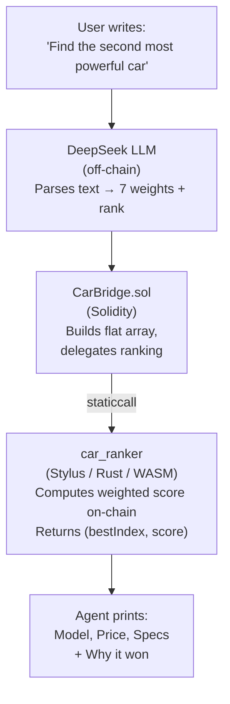

# 🚗 RentalRide — AI Agent for Verifiable Car Rental Search

**Natural-language AI agent that finds the best car on-chain — powered by DeepSeek + Arbitrum Stylus.**

---

## What is this

**RentalRide** is an AI agent for car rental search with **verifiable on-chain ranking**.

The user describes what they want in plain language — *"cheapest electric car with the best interior"* or *"the second most powerful car"*. A DeepSeek LLM extracts 7 numeric weights (and optionally a rank: 1st, 2nd, 3rd best). A **Stylus smart contract written in Rust** then ranks 100+ cars **on-chain** and returns the best match.

Unlike traditional aggregators (Trivago, Booking), where a central server decides what to show, here **every calculation is public and reproducible**. The LLM only parses language; the ranking itself happens on-chain and can be verified by anyone.

---

## Why it matters

| Aspect | Traditional Aggregator | RentalRide |
|---|---|---|
| Who decides "the best" | Company server | Smart contract |
| How users interact | Sliders and filters | **Natural language (LLM)** |
| Can you verify the formula | ❌ No | ✅ Yes, anyone can call it |
| Can the formula be changed secretly | ✅ Yes | ❌ No, only via public tx |
| Can advertisers buy top spot | ✅ Yes | ❌ No, formula doesn't know ads |
| Can the result be faked | ✅ Yes | ❌ No, result is on-chain |
| Can the LLM manipulate the result | — | ❌ No, it only converts text to numbers |

---

## How it works

The user writes a request in natural language. DeepSeek parses it into numeric weights. Stylus ranks cars on-chain.

**Key insight:** The LLM cannot manipulate the result — it only converts language into numbers. The ranking is done by an on-chain Rust contract, verifiable by anyone.

**Key insight:** The LLM cannot manipulate the result — it only converts language into numbers. The ranking is done by an on-chain Rust contract, verifiable by anyone.

---

## Architecture

**1) Frontend**
- Streamlit chat UI — `[http://localhost:8501](http://194.5.152.242:8501)`
- CLI agent — `python agent.py "..."`

**2) Agent layer**
- `agent.py` — CLI, calls LLM + contract
- `app.py` — Streamlit web UI

**3) Backend**
- Spring Boot 3.2.5 (Java 21)
- CarController → CarRankingService → Web3j
- REST API: `POST /api/cars/find-best`

**4) Smart Contracts**
- **CarBridge.sol** (Solidity 0.8.23) — stores 100+ cars
  `0x484cB35720a9bB6fcEA175e041A221408d01eC02`
- **car_ranker** (Stylus / Rust / WASM) — computes ranking
  `0x766a3bee23F071805B6619545E86B5E9a4F760F0`

---

## Ranking Criteria

The Stylus contract computes a weighted score based on **7 criteria**:

| # | Criterion | Direction | Normalization |
|---|---|---|---|
| 1 | 💰 Price per day | Lower is better | Inverted (linear) |
| 2 | 🛣️ Mileage | Lower is better | Inverted |
| 3 | ⚡ Engine power | Higher is better | Linear |
| 4 | ⭐ Rating | Higher is better | Linear |
| 5 | 📅 Year | Newer is better | Linear |
| 6 | ✨ Interior condition | Higher is better | Linear |
| 7 | 🔋 Fuel type | electric > hybrid > petrol > diesel | Pre-scored |

Plus optional **rank** (1st, 2nd, 3rd best) extracted from natural language.

---

## Tech Stack

| Layer | Technology | Purpose |
|---|---|---|
| LLM | **DeepSeek (deepseek-flash)** | Natural language → weights |
| Agent | Python + Web3.py | CLI + Streamlit UI |
| Smart Contract (compute) | **Rust + Stylus SDK 0.10.9** | On-chain ranking |
| Smart Contract (bridge) | Solidity 0.8.23 | Storage + delegation |
| Backend | Spring Boot 3.2.5, Java 21 | REST API |
| Blockchain client | Web3j 4.14.0 | Java ↔ Ethereum |
| Frontend | Streamlit + HTML/JS | Chat UI + sliders |
| Network | Robinhood Chain Testnet (Chain ID 46630) | Deployed |

---

Deployed Contracts

Network: Robinhood Chain Testnet (Chain ID 46630)
Contract	Address
Stylus car_ranker (v4)	0x766a3bee23F071805B6619545E86B5E9a4F760F0
Solidity CarBridge	0x484cB35720a9bB6fcEA175e041A221408d01eC02
Deployer	0xCc5640D6b3C13b7e21dfcb50db1752bF9c19F43b
    

MIT — see LICENSE.

